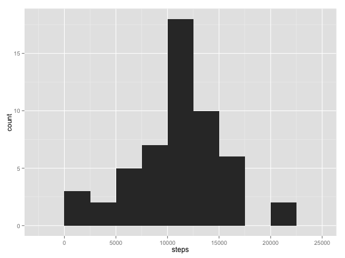

# Reproducible Research: Peer Assessment 1
Class: [Reproducible Research][1]  
Professors: Roger D. Peng, PhD; Jeff Leek, PhD; Brian Caffo, PhD

## Data

Dataset: [Activity monitoring data (52K)][2]  

The variables included in this dataset are:

- steps: Number of steps taking in a 5-minute interval (missing values are coded as NA)
- date: The date on which the measurement was taken in YYYY-MM-DD format
- interval: Identifier for the 5-minute interval in which measurement was taken

The dataset is stored in a comma-separated-value (CSV) file and there are a total of 17,568 observations in this dataset.


## Loading and preprocessing the data

Data for this assignment have been selected by Coursera and are available using the above link. The linked file is compressed and was manually unzipped into the working directory. Specific instructions from Coursera are listed below:

- Load the data (i.e. read.csv())
- Process/transform the data (if necessary) into a format suitable for your analysis

Data were read into R Studio Version 0.98.507 using the following code. Data were spot checked using the head() command and the RStudio Data GUI to identify any immediate issues for preprocessing. 


```r
data <- read.csv("activity.csv", header=TRUE)
```

The data contained a factor column for dates, so this was converted to date-time. No other data cleaning was performed until specified by the assignment.


```r
data$date <- as.Date(data$date, format="%Y-%m-%d")
```


## What is mean total number of steps taken per day?

Specific instructions from Coursera are listed below:

- For this part of the assignment, you can ignore the missing values in the dataset.
- Make a histogram of the total number of steps taken each day
- Calculate and report the mean and median total number of steps taken per day

Data processing was accomplished in a single step using the aggregate function, which ignores NA values by default. A new data frame `daily_total` was created to contain the summed steps for each day. The data head is included below for the reviewer.


```r
daily_total <- aggregate(steps ~ date, data = data, sum)
head(daily_total)
```

```
##         date steps
## 1 2012-10-02   126
## 2 2012-10-03 11352
## 3 2012-10-04 12116
## 4 2012-10-05 13294
## 5 2012-10-06 15420
## 6 2012-10-07 11015
```

The data were plotted using ggplot2. A binwidth of 2500 was selected as larger values masked some of the trending,  but smaller values left too many open spaces and did not show a clear bell curve.


```r
library(ggplot2) 
qplot(steps, data=daily_total, geom="histogram", binwidth = 2500)
```

 


## What is mean total number of steps taken per day?

Mean and median values for the steps column of the aggregate data frame are provided below. Results were rounded for clearer viewing.


```r
paste("Mean total steps taken per day:", round(mean(daily_total$steps)))
```

```
## [1] "Mean total steps taken per day: 10766"
```

```r
paste("Median total steps taken per day:", median(daily_total$steps))
```

```
## [1] "Median total steps taken per day: 10765"
```


## What is the average daily activity pattern?

Specific instructions from Coursera are listed below:

- Make a time series plot (i.e. type = "l") of the 5-minute interval (x-axis) and the average number of steps taken, averaged across all days (y-axis)
- Which 5-minute interval, on average across all the days in the dataset, contains the maximum number of steps?

Data processing was accomplished using a similar aggregation strategy, storing the new values in `daily_pattern`. Code is provided below along with the new data frame head for review.


```r
daily_pattern <- aggregate(steps ~ interval, data = data, mean)
head(daily_pattern)
```

```
##   interval   steps
## 1        0 1.71698
## 2        5 0.33962
## 3       10 0.13208
## 4       15 0.15094
## 5       20 0.07547
## 6       25 2.09434
```

Data from `daily_pattern` were plotted using ggplot2.


```r
require(ggplot2)
qplot(interval, steps, data=daily_pattern, geom="line")
```

 

As seen in the plot, there is a sharp maximum in between 750 and 1000. The exact interval was determined by first finding the maximum number of steps, and then subsetting by that maximum value to pull the associated interval from the aggregate data frame. Results are provided below.


```r
paste("Maximum average number of steps:", round(max(daily_pattern$steps)))
```

```
## [1] "Maximum average number of steps: 206"
```

```r
paste("5 minute interval with maximum average number of steps:",
      daily_pattern[(daily_pattern$steps == max(daily_pattern$steps)),1])
```

```
## [1] "5 minute interval with maximum average number of steps: 835"
```

## Imputing missing values

Specific instructions from Coursera are listed below.

- Calculate and report the total number of missing values in the dataset (i.e. the total number of rows with NAs)
- Devise a strategy for filling in all of the missing values in the dataset. The strategy does not need to be sophisticated. For example, you could use the mean/median for that day, or the mean for that 5-minute interval, etc.
- Create a new dataset that is equal to the original dataset but with the missing data filled in.
- Make a histogram of the total number of steps taken each day and Calculate and report the mean and median total number of steps taken per day. Do these values differ from the estimates from the first part of the assignment? What is the impact of imputing missing data on the estimates of the total daily number of steps?

I selected a recommended strategy of replacing NA values with the average for the 5-minute interval. These averages were already calculated during a previous section and remain stored in `daily_pattern`. To impute the missing values, I first generated a list of all the row numbers that contained an NA for the steps observation.


```r
impute_list <- grep(TRUE, is.na(data$steps))
```

The length of this list is the total number of missing values.


```r
paste("Number of NA values:", length(impute_list))
```

```
## [1] "Number of NA values: 2304"
```

This list was then used in a for loop to replace the missing values of the data frame. Each row was processed by matching to the appropriate interval value in `daily_pattern`.


```r
data_imputed <- data

for (x in impute_list){
  data_imputed[x,"steps"] <- daily_pattern[(daily_pattern$interval == data_imputed[x,"interval"]),"steps"]
}
```

Daily totals from the imputed data set were aggregated by date in `daily_imputed_total`. The data frame head is provided below for review.


```r
daily_imputed_total <- aggregate(steps ~ date, data = data_imputed, sum)
head(daily_imputed_total)
```

```
##         date steps
## 1 2012-10-01 10766
## 2 2012-10-02   126
## 3 2012-10-03 11352
## 4 2012-10-04 12116
## 5 2012-10-05 13294
## 6 2012-10-06 15420
```

These imputed totals were plotted identically to the previous data set where NA values were excluded.


```r
require(ggplot2)
qplot(steps, data=daily_imputed_total, geom="histogram", binwidth = 2500)
```

 

Mean and median values from the imputed data set were very similar to the values generated from the non-imputed data set and are provided below.


```
## [1] "Mean total steps taken per day: 10766"
```

```
## [1] "Median total steps taken per day: 10766"
```

The p value indicates that the difference between imputed and non-imputed data sets is not statistically significant.


```r
t_test <- t.test(daily_imputed_total$steps, daily_total$steps)
t_test["p.value"]  
```

```
## $p.value
## [1] 1
```


## Are there differences in activity patterns between weekdays and weekends?

Specific instructions from Coursera are provided below.

- For this part the weekdays() function may be of some help here. Use the dataset with the filled-in missing values for this part.
- Create a new factor variable in the dataset with two levels – “weekday” and “weekend” indicating whether a given date is a weekday or weekend day.
- Make a panel plot containing a time series plot (i.e. type = "l") of the 5-minute interval (x-axis) and the average number of steps taken, averaged across all weekday days or weekend days (y-axis).

An additional column was added to `data_imputed` containing the weekday names. `Saturday` and `Sunday` were then replaced with `weekend` before all other values were replaced with `weekday`. These were converted to factors for faceting.


```r
data_imputed$weekday <- weekdays(data_imputed$date)
data_imputed$weekday[data_imputed$weekday == "Saturday" | 
                       data_imputed$weekday == "Sunday"] <- "weekend"
data_imputed$weekday[data_imputed$weekday != "weekend"] <- "weekday"
data_imputed$weekday <- as.factor(data_imputed$weekday)
```

The data set was then aggregated for average steps by both interval and weekday. The head of the resulting data frame is provided below for review.


```r
weekday_pattern <- aggregate(steps ~ interval + weekday, data = data_imputed, mean)
head(weekday_pattern)
```

```
##   interval weekday   steps
## 1        0 weekday 2.25115
## 2        5 weekday 0.44528
## 3       10 weekday 0.17317
## 4       15 weekday 0.19790
## 5       20 weekday 0.09895
## 6       25 weekday 1.59036
```

The data were plotted using `weekday` to facet.


```r
require(ggplot2)
qplot(interval, steps, data=weekday_pattern, geom="line", facets= weekday~.)
```

 

The weekday pattern shows a sharp increase in movement at the beginning of each day, likely before or during the test subject's commute to work, while the weekends show a more consistent movement pattern.

[1]: https://class.coursera.org/repdata-004/human_grading/view/courses/972143/assessments/3/submissions
[2]: https://d396qusza40orc.cloudfront.net/repdata%2Fdata%2Factivity.zip
